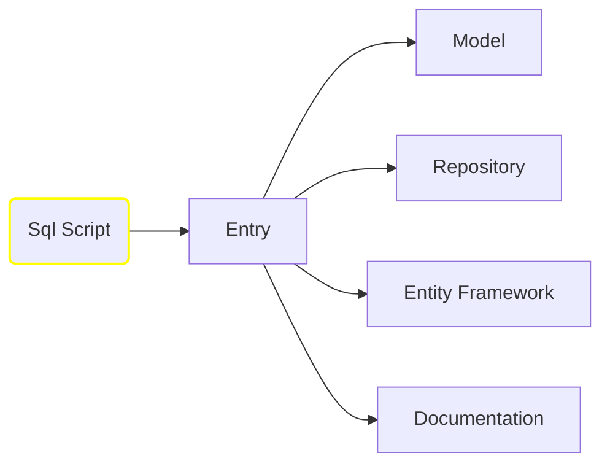

# Sql-to-Code-Generator-API

Study project to generate code, documentation or entity map, based in MSSQL script extracted from the database.

# General Workflow



## Endpoints

- **Entry** (POST)
  - **parameters**:
    - **${\color{cyan}File}$** **file** : SQl script extracted from the Managment Studio (for now it does not accept any SQL structure)
  - **returns**: **${\color{cyan}GeneratorModel}$** to be used in all the other calls
 
<details>
  <summary> ${\color{orange}Sql}$ ${\color{orange}Sample}$ ${\color{orange}Script}$  </summary>

```sql
 CREATE TABLE Product
	(
		[ID]           int identity(1,1) NOT NULL,
		[BrandID]      int NULL                  ,
		[Code]         bigint NOT NULL           ,
		[Name]         NVARCHAR(50) NOT NULL     ,
		[ExternalName] NVARCHAR(50) NOT NULL     ,
		[Description]  NVARCHAR(MAX) NULL        ,
		[ImageID]      varchar(50) NULL          ,
		[Price]        money NULL                ,
		CONSTRAINT PK_ProductImage PRIMARY KEY ( ID asc )
	)
;

---------------------------------------------------------------------------
CREATE TABLE ProductImage
	(
		[ID]        int identity(1,1) NOT NULL,
		[ProductID] bigint NOT NULL           ,
		[ImageID]   varchar(50) NULL          ,
		CONSTRAINT PK_ProductImage PRIMARY KEY ( ID asc )
	)
;

ALTER TABLE ProductImage ADD CONSTRAINT FK_ProductImage FOREIGN KEY (ProductID) REFERENCES Product(ID)
;

---------------------------------------------------------------------------
CREATE TABLE Category
	(
		[ID]                      int identity(1,1) NOT NULL,
		[Name]                    varchar(50) NOT NULL      ,
		[DesktopSpotlight]        bit NULL                  ,
		[DesktopSpotlightImageID] varchar(50) NULL          ,
		[MobileSpotlight]         bit NULL                  ,
		[MobileSpotlightImageID]  varchar(50) NULL          ,
		CONSTRAINT PK_Category PRIMARY KEY ( ID asc )
	)
---------------------------------------------------------------------------
CREATE TABLE CategoryDetail
	(
		[ID]          int identity(1,1) NOT NULL,
		[CategoryID]  int NOT NULL              ,
		[Name]        varchar(50) NOT NULL      ,
		[TitleIconID] varchar(50) NULL          ,
		CONSTRAINT PK_CategoryDetail PRIMARY KEY ( ID asc )
	)
ALTER TABLE CategoryDetail Add Constraint FK_CategoryDetail Foreign Key(CategoryID) References Category(ID)
--------------------------------------------------------------------------
CREATE TABLE Brand
	(
		[ID]                      int identity(1,1) NOT NULL,
		[Name]                    varchar(50) NOT NULL      ,
		[DesktopSpotlight]        bit NULL                  ,
		[DesktopSpotlightImageID] varchar(50) NULL          ,
		[MobileSpotlight]         bit NULL                  ,
		[MobileSpotlightImageID]  varchar(50) NULL          ,
		[Promo]                   bit NULL                  ,
		CONSTRAINT PK_Brand PRIMARY KEY ( ID asc )
	)
ALTER TABLE Product Add Constraint FK_ProductBrand Foreign Key(BrandID) References Brand(ID)
-------------------------------------------------------------------------
CREATE TABLE ProductCategoryDetail
	(
		ProductID        bigint NOT NULL,
		CategoryDetailID int NOT NULL   ,
		CONSTRAINT PK_ProductCategoryDetail PRIMARY KEY ( ProductID asc, CategoryDetailID asc, )
	)
ALTER TABLE ProductCategoryDetail Add Constraint FK_ProductCategoryDetail_Product Foreign Key(ProductID) References Product(ID)
ALTER TABLE ProductCategoryDetail Add Constraint FK_ProductCategoryDetail_Category Foreign Key(CategoryDetailID) References CategoryDetail(ID)
```

</details>

- **Model** (POST)
  - **parameters**:
    - **${\color{cyan}GeneratorModel}$** **body** : json with the structure describing the tables structure, indexes and links
  - **returns**: **${\color{cyan}string}$** with the Models and Fluent validation

- **Model/download** (POST)
  - **parameters**:
    - **${\color{cyan}GeneratorModel}$** **body** : json with the structure describing the tables structure, indexes and links
  - **returns**: **${\color{cyan}zip}$** with all Models files

- **Repository** (POST)
  - **parameters**:
    - **${\color{cyan}GeneratorModel}$** **body** : json with the structure describing the tables structure, indexes and links
  - **returns**: **${\color{cyan}string}$** with the Repositories, containing all the Sql scripts to execute the CRUD operations with joins if needed.                 

- **Repository/download** (POST)
  - **parameters**:
    - **${\color{cyan}GeneratorModel}$** **body** : json with the structure describing the tables structure, indexes and links
  - **returns**: **${\color{cyan}zip}$** with all Models files

**${\color{orange}Note}$**<br>
The repository output uses the DataExtensions project in the below link<br>
[https://github.com/eduardorauchbach/AzureAPI](https://github.com/eduardorauchbach/AzureAPI)

- **EntityFramework** (POST)
  - **parameters**:
    - **${\color{cyan}GeneratorModel}$** **body** : json with the structure describing the tables structure, indexes and links
  - **returns**: **${\color{cyan}string}$** with the Entity Map

- **Documentation** (POST)
  - **parameters**:
    - **${\color{cyan}GeneratorModel}$** **body** : json with the structure describing the tables structure, indexes and links
  - **returns**: **${\color{cyan}string}$** with the mermaid structure for the tables and markdown tables with the descriptions and links
