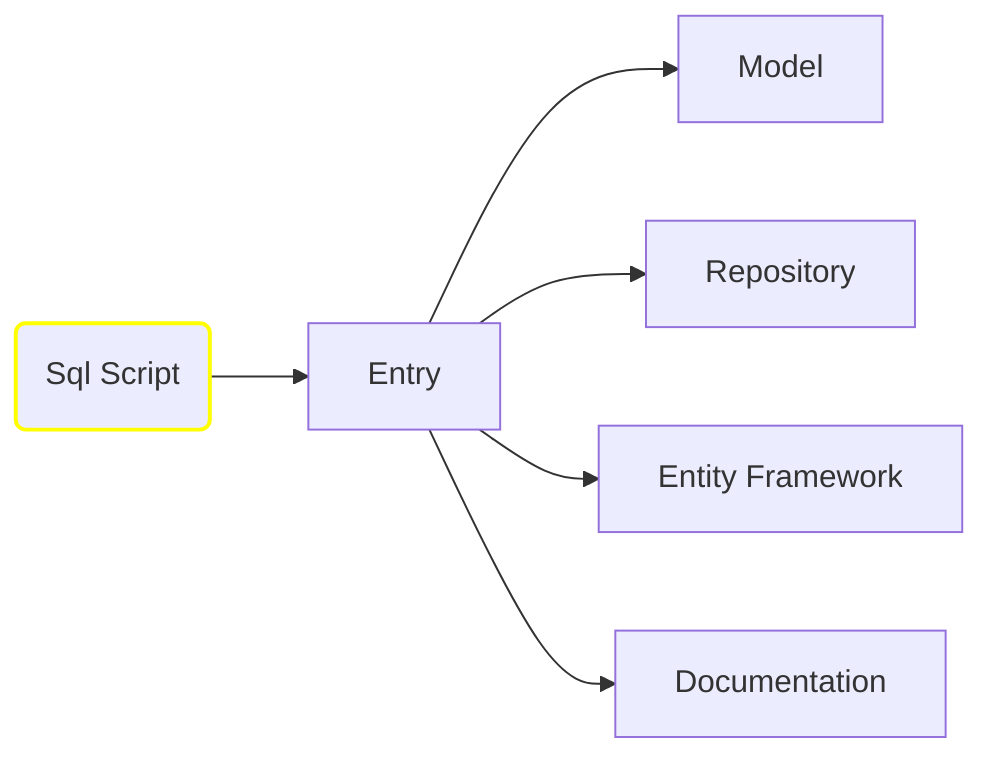

# Sql-to-Code-Generator-API

Study project to generate code, documentation or entity map, based in MSSQL script extracted from the database.

# General Workflow

## Endpoints

- **Entry** (POST)
  - **parameters**:
    - **${\color{cyan}File}$** **file** : SQl script extracted from the Managment Studio (for now it does not accept any SQL structure)
  - **returns**: **${\color{cyan}GeneratorModel}$** to be used in all the other calls

- **Model** (POST)
  - **parameters**:
    - **${\color{cyan}GeneratorModel}$** **body** : json with the structure describing the tables structure, indexes and links
  - **returns**: **${\color{cyan}string}$** with the Models and Fluent validation

- **Model/download** (POST)
  - **parameters**:
    - **${\color{cyan}GeneratorModel}$** **body** : json with the structure describing the tables structure, indexes and links
  - **returns**: **${\color{cyan}zip}$** with all Models files

- **Repository** (POST)
  - **parameters**:
    - **${\color{cyan}GeneratorModel}$** **body** : json with the structure describing the tables structure, indexes and links
  - **returns**: **${\color{cyan}string}$** with the Repositories, containing all the Sql scripts to execute the CRUD operations with joins if needed.                 

- **Repository/download** (POST)
  - **parameters**:
    - **${\color{cyan}GeneratorModel}$** **body** : json with the structure describing the tables structure, indexes and links
  - **returns**: **${\color{cyan}zip}$** with all Models files

**${\color{orange}Note}$** 
The repository output uses the DataExtensions project in the below link 
[https://github.com/eduardorauchbach/AzureAPI](https://github.com/eduardorauchbach/AzureAPI)

- **EntityFramework** (POST)
  - **parameters**:
    - **${\color{cyan}GeneratorModel}$** **body** : json with the structure describing the tables structure, indexes and links
  - **returns**: **${\color{cyan}string}$** with the Entity Map

- **Documentation** (POST)
  - **parameters**:
    - **${\color{cyan}GeneratorModel}$** **body** : json with the structure describing the tables structure, indexes and links
  - **returns**: **${\color{cyan}string}$** with the mermaid structure for the tables and markdown tables with the descriptions and links
